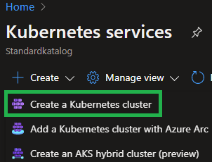

<div align="center">
  <a href="">
    
  </a>

<h3 align="center" style="font-size:50px">Telia Cygate</h3>

  <p align="center">
    A short and simple introduction to use AKS in Azure.
    <br />
    <br />
    <a href="https://github.com/BoostSebastian/Lab_002_AKS">View Demo</a>
    ·
    <a href="https://github.com/BoostSebastian/Lab_002_AKS/issues">Report Bug</a>
    ·
    <a href="https://github.com/BoostSebastian/Lab_002_AKS/issues">Request Feature</a>
  </p>
</div>

<br />
<br />


# <span style="">Implement Azure Kubernetes Service</span>
# Student lab manual

## <span style="color:#8B2CDB">Lab scenario</span>

You has a number of multi-tier applications that are not suitable to run by using Azure Container Instances. In order to determine whether they can be run as containerized workloads, you want to evaluate using Kubernetes as the container orchestrator. To further minimize management overhead, you want to test Azure Kubernetes Service, including its simplified deployment experience and scaling capabilities.


## <span style="color:#8B2CDB">Objectives</span>

In this lab, you will:

+ Task 1: Register the Microsoft.Kubernetes and Microsoft.KubernetesConfiguration resource providers.
+ Task 2: Deploy an Azure Kubernetes Service cluster
+ Task 3: Deploy pods into the Azure Kubernetes Service cluster
+ Task 4: Scale containerized workloads in the Azure Kubernetes service cluster

<br />

## <span style="color:#8B2CDB">Architecture diagram</span>


<br />
<br />

## <span style="color:#8B2CDB">Instructions</span>


### <span style="color:#5bb776">Exercise 1</span>

#### <span style="color:#5bb776">Task 1:</span> Register the Microsoft.Kubernetes and Microsoft.KubernetesConfiguration resource providers.

In this task, you will register resource providers necessary to deploy an Azure Kubernetes Services cluster.

1. Sign in to the [Azure portal](https://portal.azure.com).

1. In the Azure portal, open the **Azure Cloud Shell** by clicking on the icon in the top right of the Azure Portal.

1. If prompted to select either **Bash** or **PowerShell**, select **Bash**.

    >**Note**: If this is the first time you are starting **Cloud Shell** and you are presented with the **You have no storage mounted** message, select the subscription you are using in this lab, and click **Create storage**.


2. Verify your subscription
   
    ```sh
    az account show --output table
    ```

    If you happends to be at the wrong subscription, find the one you want to use

    ```sh
    az account list --output table
    ```

    Move to the correct subscription 

    ```sh
    # change the active subscription using the subscription name 
    az account set --subscription "My Demos"

    # change the active subscription using the subscription ID 
    az account set --subscription "xxxxxxxx-xxxx-xxxx-xxxx-xxxxxxxxxxxx"
    ```

    Verify that you are in the correct subscription 

    ```sh
    az account show --output table
    ```
 

1. From the Cloud Shell pane, run the following to register the Microsoft.Kubernetes and Microsoft.KubernetesConfiguration resource providers.

   ```sh
   az provider register --namespace "Microsoft.Kubernetes" --wait
   
   az provider register --namespace "Microsoft.KubernetesConfiguration" --wait
   ```

1. Close the Cloud Shell pane.

#### <span style="color:#5bb776">Task 2:</span> Deploy an Azure Kubernetes Service cluster

In this task, you will deploy an Azure Kubernetes Services cluster by using the Azure portal.

1. In the Azure portal, search for locate **Kubernetes services** and then, on the **Kubernetes services** blade, click **+ Create**, and then click **+ Create a Kubernetes cluster**.

    

1. On the **Basics** tab of the **Create Kubernetes cluster** blade, specify the following settings (leave others with their default values):

    | Setting                      | Value                                                             |
    | ---------------------------- | ----------------------------------------------------------------- |
    | Subscription                 | the name of the Azure subscription you are using in this lab      |
    | Resource group               | the name of a new resource group **rg-cygate-lab**                |
    | Cluster preset configuration | **Dev/Test**                                                      |
    | Kubernetes cluster name      | **aks-cygate-lab-001**                                            |
    | Region                       | the name of a region where you can provision a Kubernetes cluster |
    | Availability zones           | **None** (uncheck all boxes)                                      |
    | AKS pricing tier             | accept the default                                                |
    | Kubernetes version           | accept the default                                                |
    | Automatic upgrade            | accept the default                                                |
    | Node size                    | accept the default                                                |
    | Scale method                 | **Manual**                                                        |
    | Node count                   | **1**                                                             |


1. Click **Next: Node Pools >** and, on the **Node Pools** tab of the **Create Kubernetes cluster** blade, leave settings with their default values:

    <br />
     
    <br />
    <br />

2. Click **Next: Node Pools >** and, on the **Node Pools** tab of the **Create Kubernetes cluster** blade, specify the following settings (leave others with their default values):


    | Setting              | Value                  |
    | -------------------- | ---------------------- |
    | Enable virtual nodes | **Disabled** (default) |

3. Click **Next: Access >** and, on the **Access** tab of the **Create Kubernetes cluster** blade, leave settings with their default values:

    | Setting               | Value                                   |
    | --------------------- | --------------------------------------- |
    | Resource identity     | **System-assigned managed identity**    |
    | Authentication method | **Local accounts with Kubernetes RBAC** |


1. Click **Next: Networking >** and, on the **Networking** tab of the **Create Kubernetes cluster** blade, leave settings with their default values:


    | Setting               | Value                                     |
    | --------------------- | ----------------------------------------- |
    | Network configuration | **kubenet**                               |
    | DNS name prefix       | **any valid, globally unique DNS prefix** |

5. Click **Next: Integrations >**, on the **Integrations** tab of the **Create Kubernetes cluster** blade, specify the following settings (leave others with their default values):


    | Setting                        | Value        |
    | ------------------------------ | ------------ |
    | Container Registry             | **None**     |
    | Enable recommended alert rules | **Uncheck**  |
    | Enable Container Logs          | **Disabled** |
    | Azure Policy                   | **Disabled** |

    
6.  Click **Review + create** (at the top, you can skip advanced & tags), ensure that the validation passed and click **Create**.

    >**Note**: In production scenarios, you would want to enable monitoring. Monitoring is disabled in this case since it is not covered in the lab.

    >**Note**: Wait for the deployment to complete. This should take about 10 minutes.

#### <span style="color:#5bb776">Task 3:</span> Deploy pods into the Azure Kubernetes Service cluster

In this task, you will deploy a pod into the Azure Kubernetes Service cluster.

1. On the deployment blade, click the **Go to resource** link.

2. On the **aks-cygate-lab-001** Kubernetes service blade, in the **Settings** section, click **Node pools**.

3. On the **aks-cygate-lab-001 - Node pools** blade, verify that the cluster consists of a single pool with one node.

    

1. In the Azure portal, open the **Azure Cloud Shell** by clicking on the icon in the top right of the Azure Portal.


5. Switch the **Azure Cloud Shell** to **Bash** (black background).

6. From the Cloud Shell pane, run the following to retrieve the credentials to access the AKS cluster:

    ```sh
    RESOURCE_GROUP='rg-cygate-lab'
    AKS_CLUSTER='aks-cygate-lab-001'

    az aks get-credentials --resource-group $RESOURCE_GROUP --name $AKS_CLUSTER
    ```

7. From the **Cloud Shell** pane, run the following to verify connectivity to the AKS cluster:

    ```sh
    kubectl get nodes
    ```

8. In the **Cloud Shell** pane, review the output and verify that the one node which the cluster consists of at this point is reporting the **Ready** status.

9. From the **Cloud Shell** pane, run the following to deploy the **nginx** image from the Docker Hub:

    ```sh
    kubectl create deployment nginx-deployment --image=nginx
    ```

    > **Note**: Make sure to use lower case letters when typing the name of the deployment (nginx-deployment)

10. From the **Cloud Shell** pane, run the following to verify that a Kubernetes pod has been created:

    ```sh
    kubectl get pods
    ```

11.  From the **Cloud Shell** pane, run the following to identify the state of the deployment:

        ```sh
        kubectl get deployment
        ```

12. From the **Cloud Shell** pane, run the following to make the pod available from Internet:

    ```sh
    kubectl expose deployment nginx-deployment --port=80 --type=LoadBalancer
    ```

13. From the **Cloud Shell** pane, run the following to identify whether a public IP address has been provisioned:

    ```sh
    kubectl get service
    ```

    

14. Re-run the command until the value in the **EXTERNAL-IP** column for the **nginx-deployment** entry changes from **\<pending\>** to a public IP address. Note the public IP address in the **EXTERNAL-IP** column for **nginx-deployment**.

15. Open a browser window and navigate to the IP address you obtained in the previous step. Verify that the browser page displays the **Welcome to nginx!** message.
    
    

#### <span style="color:#5bb776">Task 4:</span> Scale containerized workloads in the Azure Kubernetes service cluster

In this task, you will scale horizontally the number of pods and then number of cluster nodes.

1. From the **Cloud Shell** pane, and run the following to scale the deployment by increasing of the number of pods to 2:

    ```sh
    # Check that it is one pod
    kubectl get pods
    #Then scale to two pods
    kubectl scale --replicas=2 deployment/nginx-deployment
    ```

1. From the **Cloud Shell** pane, run the following to verify the outcome of scaling the deployment:

    ```sh
    kubectl get pods
    ```

    > **Note**: Review the output of the command and verify that the number of pods increased to 2.

1. From the **Cloud Shell** pane, run the following to scale out the cluster by increasing the number of nodes to 2:

    ```sh
    # Check that it is one node
    kubectl get nodes
    # Then scale to two nodes

    RESOURCE_GROUP='rg-cygate-lab'
    AKS_CLUSTER='aks-cygate-lab-001'

    az aks scale --resource-group $RESOURCE_GROUP --name $AKS_CLUSTER --node-count 2
    ```

    > **Note**: Wait for the provisioning of the additional node to complete. This might take about 3 minutes. If it fails, rerun the `az aks scale` command.

1. From the **Cloud Shell** pane, run the following to verify the outcome of scaling the cluster:

    ```sh
    kubectl get nodes
    ```

    > **Note**: Review the output of the command and verify that the number of nodes increased to 2.

1. From the **Cloud Shell** pane, and run the following to scale the deployment by increasing of the number of pods to 10:

    ```sh
    kubectl scale --replicas=10 deployment/nginx-deployment
    ```

1. From the **Cloud Shell** pane, run the following to verify the outcome of scaling the deployment:

    ```sh
    kubectl get pods
    ```

    > **Note**: Review the output of the command and verify that the number of pods increased to 10.

1. From the **Cloud Shell** pane, run the following to review the pods distribution across cluster nodes:

    ```sh
    kubectl get pod -o=custom-columns=NODE:.spec.nodeName,POD:.metadata.name
    ```

    > **Note**: Review the output of the command and verify that the pods are distributed across both nodes.

1. From the **Cloud Shell** pane, run the following to delete the deployment:

    ```sh
    kubectl delete deployment nginx-deployment
    ```

1. Now we re going to try do deply an application with a ***YAML*** file. Let's start by creating a file.

    ```sh
    code
    ```

2. Close the **Cloud Shell** pane.

#### Clean up resources

>**Note**: Remember to remove any newly created Azure resources that you no longer use. Removing unused resources ensures you will not see unexpected charges.

>**Note**:  Don't worry if the lab resources cannot be immediately removed. Sometimes resources have dependencies and take a long time to delete. It is a common Administrator task to monitor resource usage, so just periodically review your resources in the Portal to see how the cleanup is going. 

1. In the Azure portal, open the **Bash** shell session within the **Cloud Shell** pane.

1. List all resource groups created throughout the labs of this module by running the following command:

   ```sh
   az group list --query "[?starts_with(name,'rg-cygate')].name" --output tsv
   ```

1. Delete all resource groups you created throughout the labs of this module by running the following command:

   ```sh
   az group list --query "[?starts_with(name,'rg-cygate')].[name]" --output tsv | xargs -L1 bash -c 'az group delete --name $0 --yes'
   ```

#### Review

In this lab, you have:

+ Deployed an Azure Kubernetes Service cluster
+ Deployed pods into the Azure Kubernetes Service cluster
+ Made the service available from Internet
+ Scaled containerized workloads in the Azure Kubernetes service cluster
